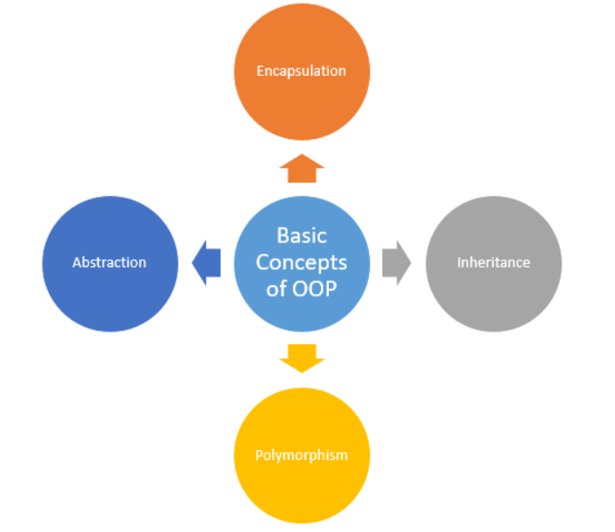
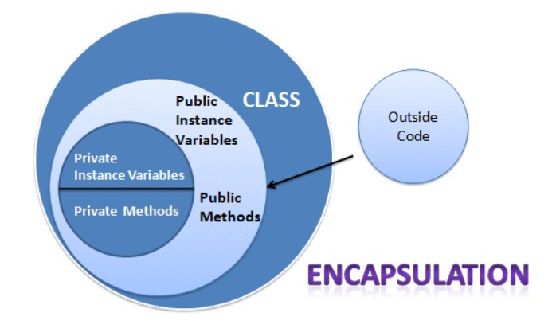
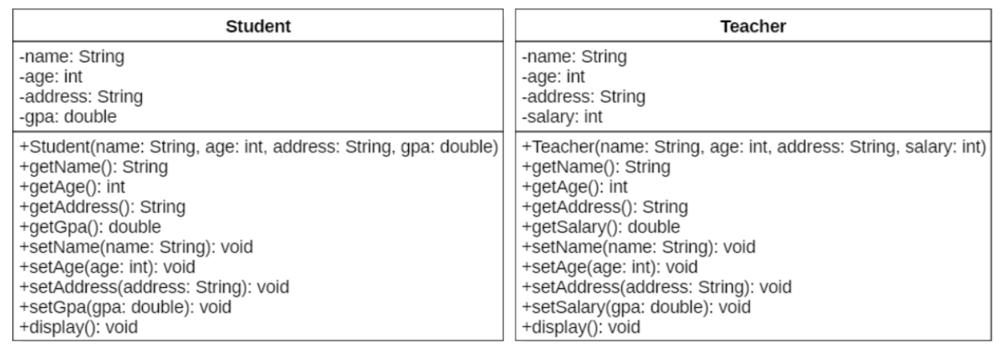
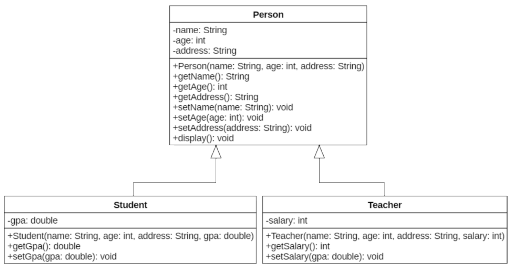

# Object Oriented Programming(OOP) C++
## I. Giới thiệu chung
- Lập trình hướng đối tượng (Object-Oriented Programming - OOP) trong C++ là một phương pháp lập trình dựa trên việc tổ chức chương trình thành các đối tượng (objects). Các đối tượng này là các thực thể cụ thể được tạo ra từ lớp (class), và chúng có thể có những thuộc tính(properties) và các phương thức (methods).

## II. Class and Object
### 1. Khởi tạo Lớp (Class)
``` Cpp
class ClassName
{
private:
    /* Properties */
    /* Methods */
public:
    /* Constructor */
    ClassName(/* Args */);
    /* Destructor */
    ~ClassName();
    /* Properties */
    /* Methods */
protected:
    /* Properties */
    /* Methods */
};
```
### 2. Thành phần trong một lớp (Class)
#### Chỉ thị truy cập (Access specifiers)
- Trong C++, chỉ thị truy cập (Access specifiers) được dùng để quy định mức độ truy cập đến các thành viên (thuộc tính, phương thức) của lớp (class). Có 3 mức độ chính:
- `public`
    - Các thành viên được khai báo public có thể truy cập từ bất kỳ đâu (trong hoặc ngoài lớp).
    - Thường dùng cho hàm thành viên (method) mà ta muốn cho phép gọi từ bên ngoài.
- `private`
    - Thành viên private chỉ được truy cập bên trong chính lớp đó.
    - Đây là mặc định trong class (nếu không ghi rõ thì thành viên sẽ là private).
    - Dùng để che giấu dữ liệu (encapsulation).
- `protected`
    - Thành viên protected giống private, nhưng lớp dẫn xuất (class con) có thể truy cập.
    - Thường dùng trong kế thừa (inheritance).
#### Hàm khởi tạo (Constructor)
- Hàm khởi tạo (constructor) là hàm đặc biệt trong class, được gọi tự động khi đối tượng được tạo ra.
- Nó có cùng tên với class và không có kiểu trả về (kể cả void).
- Dùng để khởi tạo giá trị ban đầu cho các thuộc tính (data members)
- Trong 1 Class có thể không có hoặc có nhiều hàm khởi tạo. Trường hợp không có hàm khởi tạo -> khi khởi tạo obj chương trình tự động gọi implicit constructor (hàm khởi tạo mặc định)
``` Cpp
ClassName:: ClassName(/* Args */)
{
    /*...*/
}
``` 
#### Initializer list
- Initializer list là một cách gán giá trị ban đầu cho các thuộc tính (data members) của class ngay khi gọi constructor.
``` Cpp
ClassName:: ClassName(/* Args */) : Properti1(Arg1), Properi2(Arg2), ...
{
    /*...*/
}
```
#### Hàm hủy (Destructor)
- Hàm hủy (destructor) là hàm đặc biệt trong C++, được gọi tự động khi đối tượng bị hủy (ra khỏi phạm vi, hoặc khi delete).
- Dùng để: 
    - Giải phóng tài nguyên (bộ nhớ cấp phát động, file, kết nối,…).
    - Dọn dẹp dữ liệu trước khi đối tượng biến mất.
``` Cpp
ClassName:: ~ClassName()
{
    /*...*/
}
```
#### Thuộc tính (Property)
- Thuộc tính trong OOP có thể được coi là các biến
#### Phương thức (Method)
- Phương thức có thể coi là các hàm
``` Cpp
data_type ClassName:: method(/* Arg */)
{
    /*...*/
}
```
### 3. khai báo đối tượng(Object)
``` Cpp
/* Variable */
ClassName obj(/* Args */);
/* Pointer */
ClassName *obj = new ClassName(/* Args */);
```
### 4. Sử dụng đối tượng
``` Cpp
/* Variable */
obj.method(/* Args */);
/* Pointer */
obj->method(/* Args */);
```
## III. Đặc tính của OOP
### 1. Tính đóng gói (Encapsulation)
- Là việc gói dữ liệu (thuộc tính) và phương thức (hành vi) vào trong một class.
- Giúp che giấu dữ liệu, chỉ cho phép truy cập thông qua các phương thức getter và setter.
- Thực hiện nhờ các mức truy cập: private, protected, public.

### 2. Tính kế thừa (Inheritance)
#### Giới thiệu chung
- C++ Cho phép một class thừa hưởng thuộc tính và phương thức từ class khác.
- Giúp tái sử dụng code, dễ mở rộng, xây dựng hệ thống phân cấp.
- C++ hỗ trợ:
    - Single inheritance (một cha – một con)
    - Multiple inheritance (một con có nhiều cha)
- Khi lập trình chắc chắn sẽ có những trường hợp mà các đối tượng có chung một số thuộc tính và phương thức. Trong trường hợp này class Teacher và class Student có một vài thuộc tính và phương thức chung và có thể kế thừa lại từ class Person. Việc này khiến code ko bị dài dòng hoặc trùng lặp


#### Kế thừa phương thức
- Khi một lớp kế thừa lớp khác, tất cả phương thức public và protected của lớp cha sẽ có trong lớp con.
``` Cpp
class ClassName : public ClassParent 
{
    /*...*/
};
```
#### Ghi đè phương thức (Overriding)
- Nếu class con định nghĩa lại một phương thức trùng tên và cùng tham số với class cha → phương thức của class con sẽ ghi đè (override).
- Để cho phép đa hình runtime polymorphism, ta cần dùng virtual function.
``` Cpp
// Example
class parentClass
{
public:
    virtual void show()
    {
        cout << "hello, I'm parent class" << endl;
    }
}

class childClass : public parentClass
{
public:
    void show override()
    {
        cout << "hello, I'm child class" << endl;
    }
}

int main()
{
    parentClass *testClass = new childClass();
    test->show();
}
```
- Nếu bỏ từ khóa `virtual` kết quả sẽ sử dụng phương thức show của parentClass
#### Gọi lại phương thức của class cha
- Trong class con, nếu cần gọi lại phương thức của class cha (dù đã override), ta dùng toán tử phạm vi `::`
``` Cpp
class childClass : public parentClass
{
public:
    void childMethod()
    {
        parentClass::parentMethod();
        /*...*/
    }
}
```
### 3. Tính đa hình (Polymorphism)
- Đa hình được hiểu là trong từng hoàn cảnh, từng trường hợp khác nhau thì các đối tượng sẽ đóng các vai trò khác nhau.
#### Đa hình với nạp chồng phương thức
- có thể phương thức cùng tên nhưng khác kiểu trả về hoặc tham số truyền vào
``` Cpp
// Example
class Calculator {
public:
	int add(int a, int b) {
		return a + b;
	}

	double add(double a, double b) {
		return a + b;
	}

	int add(int a, int b, int c) {
		return a + b + c;
	}
};
```
#### Đa hình với ghi đè phương thức
#### Đa hình thông qua các đối tượng đa hình
### 4. Tính trừu  (Abstraction) 
- Trừu tượng (Abstraction) nghĩa là che giấu chi tiết cài đặt, chỉ để lộ ra cái gì đối tượng làm (interface), không cần biết nó làm như thế nào (implementation).

- Giúp lập trình viên làm việc với mô hình khái niệm, không phải chi tiết bên trong.

- `Ví dụ`: Khi bạn dùng xe hơi, bạn chỉ cần biết đạp ga để chạy, đạp phanh để dừng → không cần biết động cơ hoạt động thế nào.

#### Lớp trừu tượng (Abstract Class)
- Một lớp chứa ít nhất một hàm thuần ảo (pure virtual function) → trở thành lớp trừu tượng.
- Không thể tạo đối tượng trực tiếp từ lớp trừu tượng.
- Các lớp con phải override các hàm thuần ảo.
``` Cpp
#include <iostream>
using namespace std;

class Shape { // lớp trừu tượng
public:
    virtual void draw() = 0; // pure virtual function
};

class Circle : public Shape {
public:
    void draw() override {
        cout << "Drawing Circle\n";
    }
};

class Rectangle : public Shape {
public:
    void draw() override {
        cout << "Drawing Rectangle\n";
    }
};

int main() {
    Shape* s1 = new Circle();
    Shape* s2 = new Rectangle();

    s1->draw();  // Drawing Circle
    s2->draw();  // Drawing Rectangle

    delete s1;
    delete s2;
}
```
#### Interface (mô phỏng bằng abstract class)
- C++ không có interface như Java/C#, nhưng có thể tạo bằng class chỉ chứa pure virtual functions.
- Các class con sẽ implement toàn bộ.
``` Cpp
class IAnimal {
public:
    virtual void sound() = 0;
    virtual void move() = 0;
    virtual ~IAnimal() = default; // destructor ảo
};

class Dog : public IAnimal {
public:
    void sound() override { cout << "Woof!\n"; }
    void move() override { cout << "Running on 4 legs\n"; }
};
```
### Lớp mẫu (Template Class)
- Lớp mẫu (class template) là một khuôn mẫu (mẫu thiết kế) để tạo ra các lớp với kiểu dữ liệu chưa xác định trước.
- Thay vì viết nhiều class cho từng kiểu dữ liệu, ta viết một class template dùng được cho nhiều kiểu.

``` Cpp
template <typename T>
class Box {
private:
    T value;
public:
    Box(T v) : value(v) {}
    T getValue() { return value; }
};
```

### Nạp trồng toán tử (Operator overloading)
- Cho phép ta định nghĩa lại cách hoạt động của các toán tử (+, -, ==, [], …) đối với đối tượng của lớp do ta tạo ra.
- Thực hiện bằng cách viết hàm đặc biệt operator< toán tử >.
- Có thể viết dưới dạng:
    - Hàm thành viên (operator method trong class)
    - Hàm bạn (friend function)


